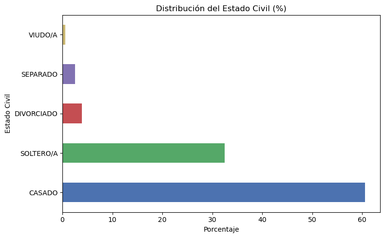
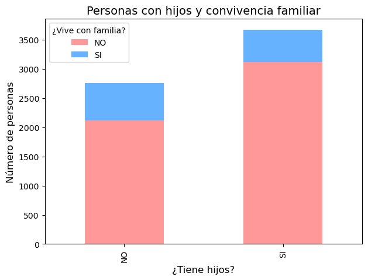
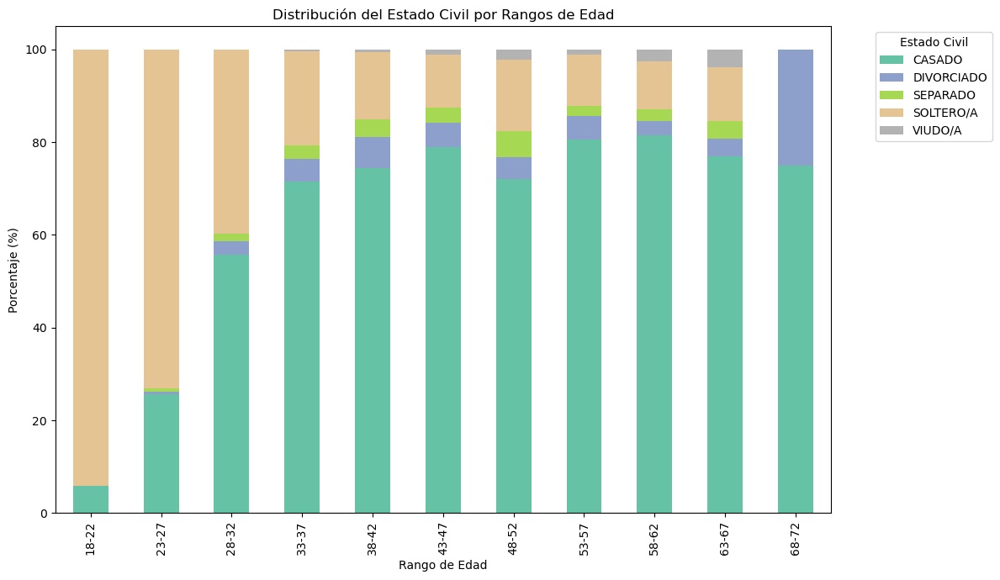

### **Estudiante B: Análisis Familia**

**Responsabilidades:**

1. Explorar variables relacionadas con familia
2. Analizar estado civil, hijos, convivencia
3. Identificar patrones familiares


```python
import pandas as pd
import matplotlib.pyplot as plt
df = pd.read_excel("C:/Users/aleja/OneDrive/Documentos/Python_para_Analitica_y_Mineria_de_Datos/analisis-datos-fac-equipo-Nose/datos/JEFAB_2024.xlsx")

print("Cargue de los datos")
```

    Cargue de los datos
    


```python
# Análisis de estado civil
print("=== ANÁLISIS ESTADO CIVIL ===")
print(df['ESTADO_CIVIL'].value_counts())
# Contar valores faltantes
faltantes = df["ESTADO_CIVIL"].isna().sum()
print("Número de valores faltantes en ESTADO_CIVIL:", faltantes)
```

    === ANÁLISIS ESTADO CIVIL ===
    ESTADO_CIVIL
    CASADO        3889
    SOLTERO/A     2084
    DIVORCIADO     250
    SEPARADO       161
    VIUDO/A         39
    Name: count, dtype: int64
    Número de valores faltantes en ESTADO_CIVIL: 0
    


```python
# Análisis de hijos
print("\n=== ANÁLISIS DE HIJOS ===")
print(f"Personal con hijos: {df['HIJOS'].value_counts()}")
# Contar valores faltantes
faltantes = df["HIJOS"].isna().sum()
print("Número de valores faltantes en HIJOS:", faltantes)
```

    
    === ANÁLISIS DE HIJOS ===
    Personal con hijos: HIJOS
    SI    3669
    NO    2754
    Name: count, dtype: int64
    Número de valores faltantes en HIJOS: 0
    


```python
# Análisis de convivencia familiar
print("\n=== ANÁLISIS DE CONVIVENCIA ===")
print(f"Habita con familia: {df['HABITA_VIVIENDA_FAMILIAR'].value_counts()}")
# Contar valores faltantes
faltantes = df["HABITA_VIVIENDA_FAMILIAR"].isna().sum()
print("Número de valores faltantes en HABITA VIVIENDA FAMILIAR:", faltantes)
```

    
    === ANÁLISIS DE CONVIVENCIA ===
    Habita con familia: HABITA_VIVIENDA_FAMILIAR
    NO    5238
    SI    1185
    Name: count, dtype: int64
    Número de valores faltantes en HABITA VIVIENDA FAMILIAR: 0
    


```python
# Gráfico de estado civil
plt.figure(figsize=(10, 6))
df['ESTADO_CIVIL'].value_counts().plot(kind='bar')
plt.title('Distribución del Estado Civil')
plt.xlabel('Estado Civil')
plt.ylabel('Cantidad')
plt.xticks(rotation=45)
plt.tight_layout()
plt.show()
```


    

    


## **Preguntas a responder:**

 **1. ¿Qué porcentaje del personal está casado?**
 
 **2. ¿Cuántos tienen hijos y cuántos viven con ellos?**
 
 **3. ¿Hay relación entre edad y estado civil?**

#### **Respuesta 1**


```python
estado_counts = df['ESTADO_CIVIL'].value_counts()

# Calcular porcentajes
estado_pct = (estado_counts / estado_counts.sum()) * 100

# Gráfico de barras horizontales
plt.figure(figsize=(8, 5))
estado_pct.plot(kind='barh', color=['#4C72B0', '#55A868', '#C44E52', '#8172B2', '#CCB974'])
plt.title('Distribución del Estado Civil (%)')
plt.xlabel('Porcentaje')
plt.ylabel('Estado Civil')
plt.tight_layout()
plt.show()

# Mostrar porcentaje casados
porcentaje_casados = estado_pct["CASADO"]
print(f"Porcentaje del personal casado: {porcentaje_casados:.2f}%")

```


    

    


    Porcentaje del personal casado: 60.55%
    

Del total del personal analizado (6423 personas), aproximadamente el 60.5% está casado.

Esto indica que la mayoría del personal mantiene una relación conyugal formal, lo cual puede ser relevante en la encuesta, ya que nos da a conocer que gran parte de los soldados mantiene un compromiso estable, y a su vez gran parte se puede llegar a concluir que son familiares del personal activo, ya que la poblacion encuestada se encuentra entre los 23 y 42 años.

#### **Respuesta 2**


```python
import pandas as pd

# Tabla cruzada entre tener hijos y habitar con familia
tabla_hijos = pd.crosstab(df["HIJOS"], df["HABITA_VIVIENDA_FAMILIAR"], margins=True)
tabla_hijos

```


<div>
<style scoped>
    .dataframe tbody tr th:only-of-type {
        vertical-align: middle;
    }

    .dataframe tbody tr th {
        vertical-align: top;
    }

    .dataframe thead th {
        text-align: right;
    }
</style>
<table border="1" class="dataframe">
  <thead>
    <tr style="text-align: right;">
      <th>HABITA_VIVIENDA_FAMILIAR</th>
      <th>NO</th>
      <th>SI</th>
      <th>All</th>
    </tr>
    <tr>
      <th>HIJOS</th>
      <th></th>
      <th></th>
      <th></th>
    </tr>
  </thead>
  <tbody>
    <tr>
      <th>NO</th>
      <td>2118</td>
      <td>636</td>
      <td>2754</td>
    </tr>
    <tr>
      <th>SI</th>
      <td>3120</td>
      <td>549</td>
      <td>3669</td>
    </tr>
    <tr>
      <th>All</th>
      <td>5238</td>
      <td>1185</td>
      <td>6423</td>
    </tr>
  </tbody>
</table>
</div>


```python
import matplotlib.pyplot as plt

tabla_hijos_plot = pd.crosstab(df["HIJOS"], df["HABITA_VIVIENDA_FAMILIAR"])

tabla_hijos_plot.plot(kind="bar", stacked=True, figsize=(7,5), color=["#FF9999","#66B2FF"])
plt.title("Personas con hijos y convivencia familiar", fontsize=14)
plt.xlabel("¿Tiene hijos?", fontsize=12)
plt.ylabel("Número de personas", fontsize=12)
plt.legend(title="¿Vive con familia?")
plt.show()

```


    

    


En la FAC, 3.669 personas tienen hijos, pero solo 549 de ellas viven con ellos, mientras que 3.120 no conviven con sus hijos.

#### **Respuesta 3**


```python
import seaborn as sns

# Tabla cruzada: Edad vs Estado Civil
tabla = pd.crosstab(df["EDAD_RANGO"], df["ESTADO_CIVIL"])
print("=== TABLA EDAD vs ESTADO CIVIL ===")
print(tabla)

# Normalizar por filas para ver proporciones
tabla_prop = pd.crosstab(df["EDAD_RANGO"], df["ESTADO_CIVIL"], normalize="index") * 100

```

    === TABLA EDAD vs ESTADO CIVIL ===
    ESTADO_CIVIL  CASADO  DIVORCIADO  SEPARADO  SOLTERO/A  VIUDO/A
    EDAD_RANGO                                                    
    18-22             18           0         0        291        0
    23-27            245           6         6        701        0
    28-32            675          34        20        481        1
    33-37            897          61        37        254        5
    38-42            753          68        38        147        6
    43-47            474          32        20         68        7
    48-52            339          22        26         73       10
    53-57            299          19         8         41        4
    58-62            158           6         5         20        5
    63-67             20           1         1          3        1
    68-72              3           1         0          0        0
    


```python
plt.figure(figsize=(10,6))
tabla_prop.plot(kind="bar", stacked=True, colormap="Set2", figsize=(12,7))

plt.title("Distribución del Estado Civil por Rangos de Edad")
plt.ylabel("Porcentaje (%)")
plt.xlabel("Rango de Edad")
plt.legend(title="Estado Civil", bbox_to_anchor=(1.05, 1), loc="upper left")
plt.tight_layout()
plt.show()

```


    <Figure size 1000x600 with 0 Axes>


    

    


La tabla y la gráfica muestran que en los rangos de menor edad (18-27 años) predomina la soltería, mientras que a partir de los 28 años aumenta significativamente la proporción de personas casadas, convirtiéndose en el estado civil predominante en los grupos de edad intermedia (28-57 años). En los grupos de mayor edad, además del matrimonio, aparecen con más frecuencia situaciones como el divorcio, la separación y la viudez, lo que refleja los cambios en la vida familiar a lo largo del ciclo de vida. Esto indica que el estado civil está fuertemente condicionado por la edad.


```python
!jupyter nbconvert --to markdown "Analisis_Familiar.ipynb" --output-dir="C:/Users/aleja/OneDrive/Documentos/Python_para_Analitica_y_Mineria_de_Datos/analisis-datos-fac-equipo-Nose/Reportes"

```
