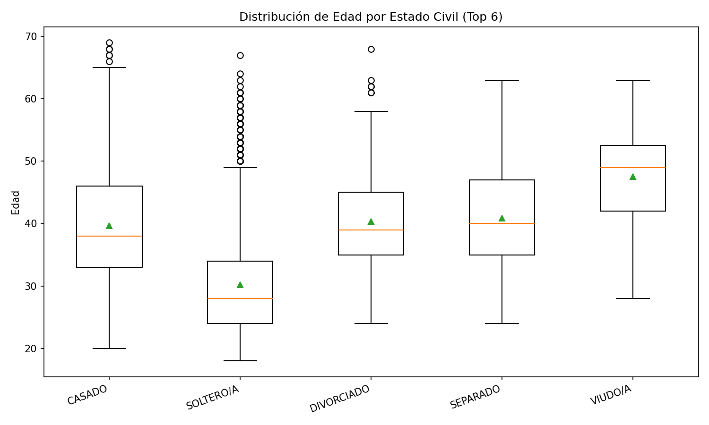

# Análisis Familiar

## Introducción
Este informe corresponde a la **Parte B** del proyecto *Análisis de Datos FAC - Bienestar Familiar*.  
Se analizan variables de **estado civil, hijos y convivencia** con el fin de identificar patrones familiares y su relación con la edad.

Los datos provienen de la encuesta **JEFAB_2024.xlsx** aplicada al personal de la Fuerza Aérea Colombiana (FAC).

---

## Resultados principales

### 1) ¿Qué porcentaje del personal está casado?
- El **60.55%** del personal está casado/a.  
El estado civil de “casado/a” es el más frecuente, seguido de “soltero/a”.

**Distribución del Estado Civil**  

---

### 2) ¿Cuántos tienen hijos y cuántos viven con ellos?
- **Con hijos:** 3,669  
- **Sin hijos:** 2,754  
- **Viven con al menos un hijo (`HIJOS_EN_HOGAR > 0`): 2,742**  
- **No conviven con hijos (aunque los tienen): 927**

 Esto significa que **aprox. 85% de quienes tienen hijos conviven con ellos**.  
El 15% restante no convive, y se detectó un **0.8% de inconsistencias** (personas que dicen no tener hijos pero aparecen con `HIJOS_EN_HOGAR > 0`).

**¿Cuántos tienen hijos?**  

**P(vivir con hijos | tener hijos)**  

---

### 3) ¿Hay relación entre edad y estado civil?
Sí.  
- **Casados/as:** edad media ~39.7 años  
- **Solteros/as:** edad media ~30.2 años  
- **Divorciados/as / Separados/as:** edad media ~40–41 años  
- **Viudos/as:** edad media ~47.6 años  

 El estado civil está claramente asociado a la edad: los más jóvenes tienden a ser solteros/as, mientras que categorías como divorciado, separado o viudo aparecen en edades más altas.

**Edad por estado civil (Top 6)**  

---

### 4) % con hijos según edad
El porcentaje de personas que tienen hijos aumenta con la edad hasta ~40 años y luego disminuye.

**% con hijos por grupo de edad**  

---

### 5) % de padres que conviven con sus hijos según edad
Entre quienes tienen hijos, el % que vive con ellos es:

- 17–25: 75.6%  
- 25–30: 80.2%  
- 30–35: 85.4%  
- 35–40: 87.3%  
- 40–45: 90.5% (máximo)  
- 45–50: 88.4%  
- 50–55: 81.9%  
- 55–60: 68.9%  
- 60–70: 66.2%  

 Interpretación:  
- Jóvenes con hijos ya conviven en gran proporción.  
- La convivencia alcanza su punto más alto en edades medias (≈40–45 años).  
- A partir de los 50 años la proporción baja, ya que los hijos comienzan a independizarse.

**% padres que conviven con hijos por edad**  

---

## Conclusiones
1. **Más de la mitad del personal está casado (60.55%)**.  
2. **El 57% del personal tiene hijos**, y de ellos, la mayoría (≈85%) vive con al menos un hijo.  
3. La **edad influye en el estado civil** y en la **convivencia con hijos**.  
4. Se identifican **inconsistencias menores** en la base (ej. personas que dicen no tener hijos pero aparecen con `HIJOS_EN_HOGAR > 0`).  
5. El ciclo de vida familiar se refleja claramente: convivencia alta en edades medias y disminución en edades mayores.

