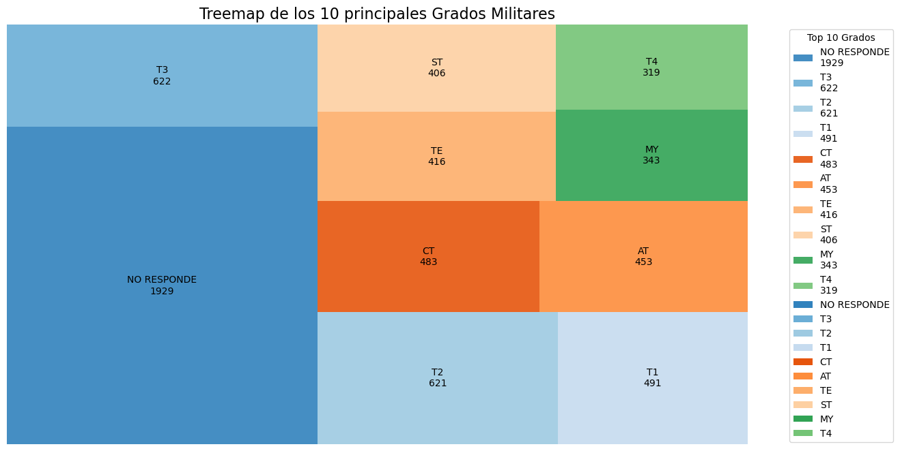

### **ESTUDIANTE A: Análisis Demográfico**

**Responsabilidades:**
  - Explorar las columnas básicas de demografía
  - Crear visualizaciones simples de edad, género, rango
  - Documentar hallazgos principales


```python
# demografia_basica.py
import pandas as pd
import matplotlib.pyplot as plt
df = pd.read_excel("C:/Users/aleja/OneDrive/Documentos/Python_para_Analitica_y_Mineria_de_Datos/analisis-datos-fac-equipo-Nose/datos/JEFAB_2024.xlsx")

print("Cargue de los datos")
```

    Cargue de los datos
    

## **Importancia de los datos de la Encuesta de Bienestar Familiar del personal FAC**

El uso de datos provenientes de la encuesta de Bienestar Familiar del personal de la Fuerza Aérea Colombiana (FAC) es fundamental para garantizar que los análisis reflejen las condiciones y necesidades actuales del personal. Estas fuentes permiten identificar de manera objetiva aspectos sociodemográficos, condiciones de vida y características del entorno familiar, brindando insumos clave para orientar políticas y programas de bienestar institucional.

En este caso, la base de datos contiene variables relevantes como Edad, Género, Estado civil, Número de hijos, Nivel educativo, y Estrato socioeconómico, las cuales proporcionan una visión integral sobre la composición de la población encuestada. Estas variables son especialmente útiles para identificar tendencias, segmentar grupos de interés y establecer comparaciones que apoyen la toma de decisiones estratégicas dentro de la FAC.  

---

#### **Cantidad de registros a analizar:**


```python
# Explorar estructura básica
print("=== INFORMACIÓN GENERAL ===")
print(f"Total de registros: {len(df)}")
print(f"Total de columnas: {len(df.columns)}")
```

    === INFORMACIÓN GENERAL ===
    Total de registros: 6423
    Total de columnas: 231
    

#### **Análisis de edad**


```python
# Análisis de edad
print("\n=== ANÁLISIS DE EDAD ===")
print(f"Edad promedio: {df['EDAD2'].mean():.1f} años")
print(f"Edad mínima: {df['EDAD2'].min()} años")
print(f"Edad máxima: {df['EDAD2'].max()} años")
```

    
    === ANÁLISIS DE EDAD ===
    Edad promedio: 36.7 años
    Edad mínima: 18.0 años
    Edad máxima: 69.0 años
    

#### **Gráfico de edades**


```python
plt.figure(figsize=(10, 6))
plt.hist(df['EDAD2'], bins=20, edgecolor='black')
plt.title('Distribución de Edades del Personal FAC')
plt.xlabel('Edad')
plt.ylabel('Cantidad de Personal')
plt.show()

```


    

    


#### **Análisis de género**


```python
# Análisis de género
print("\n=== ANÁLISIS DE GÉNERO ===")
print(df['GENERO'].value_counts())
```

    
    === ANÁLISIS DE GÉNERO ===
    GENERO
    MASCULINO     4451
    FEMENINO      1955
    OTRO            15
    NO BINARIO       2
    Name: count, dtype: int64
    

#### **Grafico de Genero**


```python
counts = df['GENERO'].value_counts() # conteo de la base
labels = list(counts.index)   
sizes = list(counts.values) # parametros en lista para la funcion a continuacion 

# Función para mostrar % solo en Masculino y Femenino
def autopct_func(pct, all_vals):
    absolute = int(round(pct/100.*sum(all_vals)))
    if absolute >= 100:  # Solo muestra porcentaje si es un grupo grande
        return f"{pct:.1f}%"
    else:
        return ""  # No mostrar nada en los pequeños

# Gráfico
plt.figure(figsize=(6,6)) # Tamaño
plt.pie(
    sizes,
    autopct=lambda pct: autopct_func(pct, sizes),
    startangle=90
) # dibuja la torta con las proporciones de genero
  # y hace cumplir la funcion para que solo se vean los porcentajes altos 
plt.legend(
    [f"{label}: {value}" for label, value in counts.items()], # Construye una lista de textos para la leyenda.
    loc="center left",
    bbox_to_anchor=(1, 0.5)
)
plt.title("Distribución por Género")
plt.show()
```


    

    


## **Preguntas a responder:**

**1. ¿Cuál es el rango de edad más común?**
 


```python
# Respuesta Primera Pregunta
edad_counts = df["EDAD_RANGO"].value_counts().sort_index() # conteo por rango 
print("\nDistribución por rangos de edad:")
print(edad_counts)
# Contar valores faltantes en EDAD_RANGO
faltantes = df["EDAD_RANGO"].isna().sum()
print("Número de valores faltantes en EDAD_RANGO:", faltantes)

```

    
    Distribución por rangos de edad:
    EDAD_RANGO
    18-22     309
    23-27     958
    28-32    1211
    33-37    1254
    38-42    1012
    43-47     601
    48-52     470
    53-57     371
    58-62     194
    63-67      26
    68-72       4
    Name: count, dtype: int64
    Número de valores faltantes en EDAD_RANGO: 13
    


```python
import matplotlib.pyplot as plt

# --- Visualización en barras ---
plt.figure(figsize=(10,6))
plt.bar(edad_counts.index, edad_counts.values, color=plt.cm.Set3.colors)  # paleta de colores variados

# Etiquetas
plt.title("Distribución por rangos de edad")
plt.xlabel("Rangos de edad")
plt.ylabel("Número de personas")

# Mostrar valores encima de las barras
for i, v in enumerate(edad_counts.values):
    plt.text(i, v + 20, str(v), ha="center", va="bottom", fontsize=9)

plt.xticks(rotation=45)
plt.tight_layout()
plt.show()

```


    

    


#### **Respuesta**

Los Rangos de Edades mas comunes son de los 28 a los 37 años, cabe resaltar que se omitieron los 13 valores faltantes encontrados en esta variable.

**2. ¿Hay diferencias en la distribución por género?**
 


```python

df_genero = df[df["GENERO"].isin(["MASCULINO", "FEMENINO"])]

# Tabla cruzada: conteo por rango de edad y género
tabla = pd.crosstab(df_genero["EDAD_RANGO"], df_genero["GENERO"])

# Asegurar que los rangos salgan ordenados como los tienes
rangos_ordenados = ["18-22","23-27","28-32","33-37","38-42",
                    "43-47","48-52","53-57","58-62","63-67","68-72"]
tabla = tabla.reindex(rangos_ordenados, fill_value=0)

print(tabla)
total_general = tabla["FEMENINO"].sum() + tabla["MASCULINO"].sum()
print("Total general (hombres + mujeres):", total_general)

```

    GENERO      FEMENINO  MASCULINO
    EDAD_RANGO                     
    18-22             81        228
    23-27            251        706
    28-32            299        909
    33-37            331        922
    38-42            290        720
    43-47            234        362
    48-52            229        237
    53-57            153        217
    58-62             76        118
    63-67              4         22
    68-72              3          1
    Total general (hombres + mujeres): 6393
    


```python
fem = -tabla["FEMENINO"]
masc = tabla["MASCULINO"]

plt.figure(figsize=(10,6))
plt.barh(tabla.index, fem, color="pink", label="Femenino")
plt.barh(tabla.index, masc, color="skyblue", label="Masculino")
plt.title("Pirámide poblacional por género y rango de edad")
plt.xlabel("Número de personas")
plt.ylabel("Rangos de edad")
plt.legend()

# Mostrar valores en las barras
for i, (f, m) in enumerate(zip(fem, masc)):
    plt.text(f - 30, i, str(abs(f)), va="center", ha="right", fontsize=8)
    plt.text(m + 30, i, str(m), va="center", ha="left", fontsize=8)

plt.tight_layout()
plt.show()

```


    

    


#### **Respuesta**

En la encuesta de bienestar familiar del personal de la Fuerza Aérea Colombiana (FAC) se observa una marcada predominancia del género masculino, que representa el 69,3% de los participantes y sobre todo entre los 28 y 37 años. En contraste, el género femenino corresponde al 30,4% con una fuerte conservacion poblacional de este genero desde los 32 hasta los 42 años. Adicionalmente, se registraron 15 casos clasificados como 'otros' y 2 casos identificados como 'no binarios'.


**3. ¿Cuál es el grado militar más frecuente?**


```python
# Análisis de género
print("\n=== ANÁLISIS DE GRADO Militar ===")
print(df['GRADO'].value_counts())

```

    
    === ANÁLISIS DE GRADO Militar ===
    GRADO
    NO RESPONDE    1929
    T3              622
    T2              621
    T1              491
    CT              483
    AT              453
    TE              416
    ST              406
    MY              343
    T4              319
    TC              140
    TS               72
    TJ               61
    CR               48
    TJC              11
    BG                5
    MG                2
    GR                1
    Name: count, dtype: int64
    


```python
!pip install squarify
```

    Collecting squarify
      Downloading squarify-0.4.4-py3-none-any.whl.metadata (600 bytes)
    Downloading squarify-0.4.4-py3-none-any.whl (4.1 kB)
    Installing collected packages: squarify
    Successfully installed squarify-0.4.4
    


```python
import matplotlib.pyplot as plt
import squarify
import matplotlib.cm as cm

# Agrupar por GRADO y contar
grado_counts = df['GRADO'].value_counts().reset_index()
grado_counts.columns = ['GRADO', 'COUNT']

# Tomar solo los 10 más grandes
top10 = grado_counts.head(10)

# Paleta de colores (tantos colores como top10 haya)
colors = cm.tab20c.colors[:len(top10)]

# Crear Treemap
plt.figure(figsize=(14, 8))
squarify.plot(
    sizes=top10['COUNT'],
    label=top10['GRADO'] + "\n" + top10['COUNT'].astype(str),
    alpha=0.9,
    color=colors
)

plt.title("Treemap de los 10 principales Grados Militares", fontsize=16)
plt.axis("off")

# Crear leyenda solo con top10
for i, grado in enumerate(top10['GRADO']):
    plt.bar(0, 0, color=colors[i], label=grado)  # truco invisible para la leyenda

plt.legend(title="Top 10 Grados", bbox_to_anchor=(1.05, 1), loc="upper left")
plt.show()


```


    

    


```python
categoria_counts = df['CATEGORIA'].value_counts().reset_index()
categoria_counts.columns = ['CATEGORIA', 'COUNT']

# Convertir a Markdown
print(categoria_counts.to_markdown(index=False))

```

    | CATEGORIA   |   COUNT |
    |:------------|--------:|
    | SUBOFICIAL  |    2650 |
    | CIVIL       |    1929 |
    | OFICIAL     |    1844 |
    

#### **Respuesta**

En la encuesta de bienestar familiar del personal de la FAC, la mayoría de los participantes se concentran en el grado de Suboficial (2.650), seguido por Civiles (1.929) y Oficiales (1.844). Dentro de los grados específicos, el mayor número de respuestas se encuentra en 'No responde' (1.929), y entre los grados militares destacan T3 (622), T2 (621) y T1 (491).


```python
!jupyter nbconvert --to markdown "demografia_basica.ipynb" --output-dir="C:/Users/aleja/OneDrive/Documentos/Python_para_Analitica_y_Mineria_de_Datos/analisis-datos-fac-equipo-Nose/Reportes"

```

    [NbConvertApp] Converting notebook demografia_basica.ipynb to markdown
    [NbConvertApp] Support files will be in demografia_basica_files\
    [NbConvertApp] Making directory C:/Users/aleja/OneDrive/Documentos/Python_para_Analitica_y_Mineria_de_Datos/analisis-datos-fac-equipo-Nose/Reportes\demografia_basica_files
    [NbConvertApp] Writing 20146 bytes to C:\Users\aleja\OneDrive\Documentos\Python_para_Analitica_y_Mineria_de_Datos\analisis-datos-fac-equipo-Nose\Reportes\demografia_basica.md
    


```python
!jupyter nbconvert --to script "demografia_basica.ipynb" --output-dir="C:/Users/aleja/OneDrive/Documentos/Python_para_Analitica_y_Mineria_de_Datos/analisis-datos-fac-equipo-Nose/Codigo Python"

```

    [NbConvertApp] Converting notebook demografia_basica.ipynb to script
    [NbConvertApp] Writing 7078 bytes to C:\Users\aleja\OneDrive\Documentos\Python_para_Analitica_y_Mineria_de_Datos\analisis-datos-fac-equipo-Nose\Codigo Python\demografia_basica.py
    
